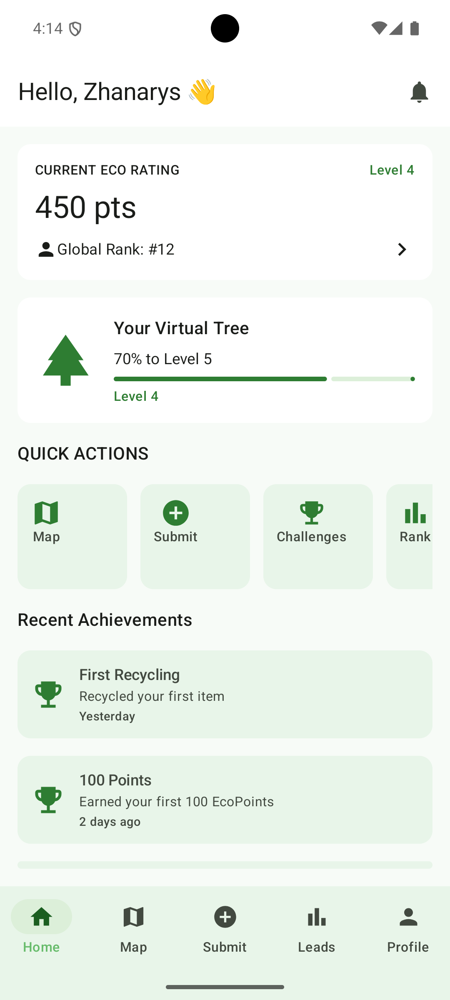
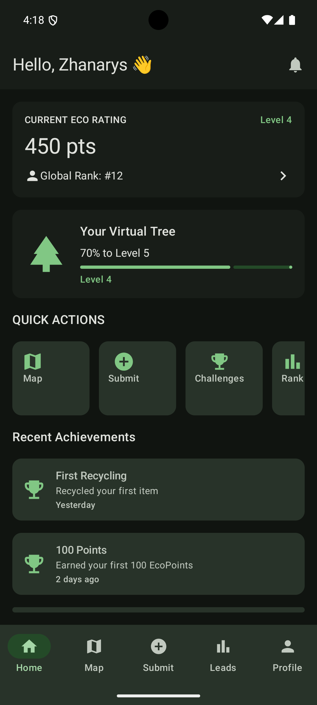
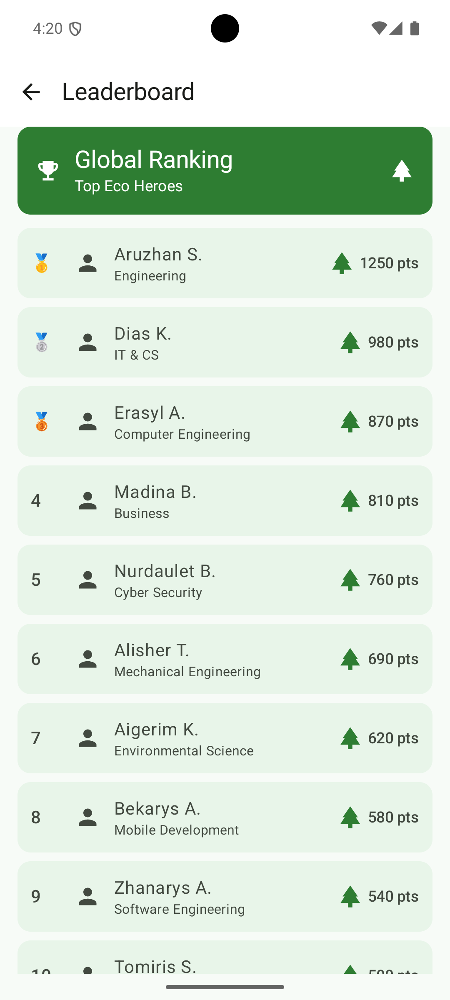
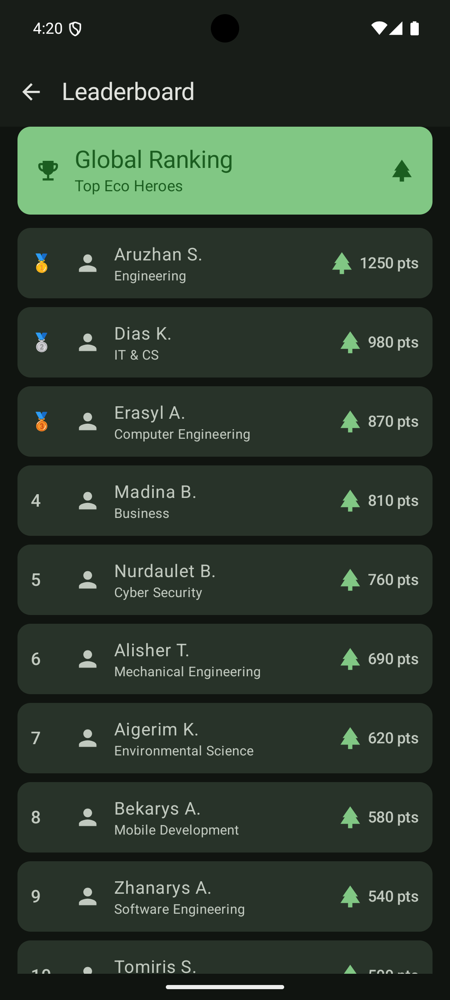
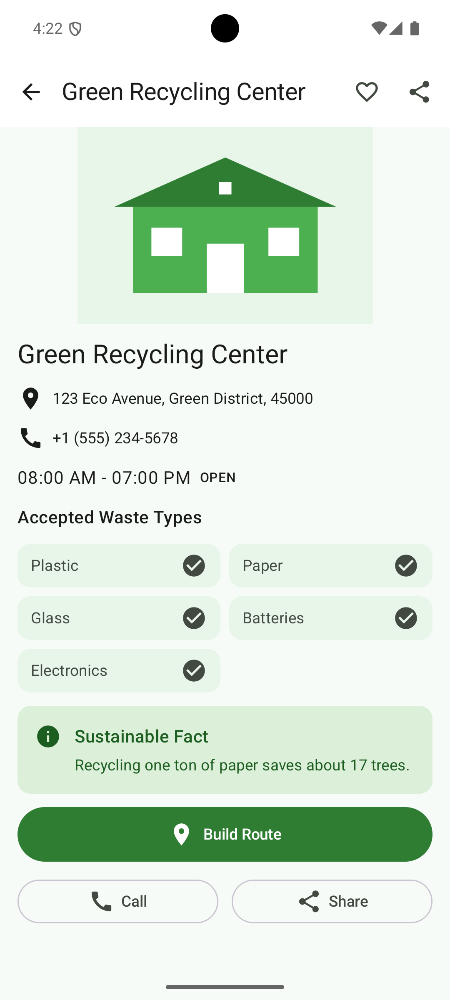
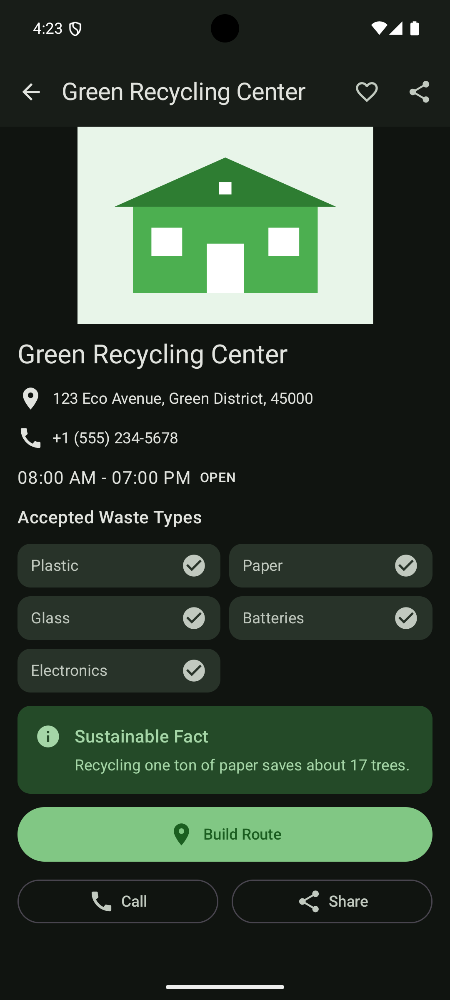

# EcoDala

EcoDala is a mobile application designed to encourage students and young people to recycle through gamification.

The application allows users to discover recycling points, check accepted waste types, track their EcoPoints and achievements, and compare their progress with other users through a leaderboard.

## SIS3 Project

This project was developed as part of the SIS3 Jetpack Compose assignment.

The project focuses on:

- Jetpack Compose UI development
- Material 3 design
- Reusable composables
- Navigation Compose
- Data-driven UI
- List and detail screens
- Light and Dark themes
- State management with Compose

## Screens

The application consists of three main screens.

### 1. Home Screen

The Home Screen provides an overview of the user's environmental progress.

It displays:

- Current EcoPoints
- User level
- Global ranking
- Virtual tree progress
- Quick actions
- Recent achievements
- Bottom navigation

<table>
<tr>
<th align="center">Light Mode</th>
<th align="center">Dark Mode</th>
</tr>
<tr>
<td align="center">

</td>
<td align="center">

</td>
</tr>
</table>

---

### 2. Leaderboard Screen

The Leaderboard Screen displays users ranked by their EcoPoints.

The screen uses a `LazyColumn` and contains 10 users.

Each leaderboard item displays:

- Rank
- User name
- Faculty
- EcoPoints

<table>
<tr>
<th align="center">Light Mode</th>
<th align="center">Dark Mode</th>
</tr>
<tr>
<td align="center">

</td>
<td align="center">

</td>
</tr>
</table>

---

### 3. Recycling Point Detail Screen

The Recycling Point Detail Screen provides detailed information about a recycling center.

It includes:

- Recycling center image
- Address
- Phone number
- Opening hours
- Accepted waste types
- Sustainability information
- Route action
- Call action
- Share action
- Favorite toggle

<table>
<tr>
<th align="center">Light Mode</th>
<th align="center">Dark Mode</th>
</tr>
<tr>
<td align="center">

</td>
<td align="center">

</td>
</tr>
</table>

## Design: From Sketch to Application

The initial UI sketches were created before implementing the final application.

The sketches are stored in the `/design` directory.

The final implementation keeps the main structure of the original sketches while refining spacing, colors, icons, typography, component layouts, and Light/Dark theme support.

### Home Screen

#### Initial Sketch

<p align="center">

</p>

#### Final Application

The final Home Screen implements the main structure of the original dashboard sketch with EcoPoints, virtual tree progress, quick actions, recent achievements, and bottom navigation.

<p align="center">

</p>

### Leaderboard Screen

#### Initial Sketch

<p align="center">

</p>

#### Final Application

The final Leaderboard Screen transforms the list concept from the original sketch into a data-driven `LazyColumn` containing 10 users with their rank, faculty, and EcoPoints.

<p align="center">

</p>

### Recycling Point Detail Screen

#### Initial Sketch

<p align="center">

</p>

#### Final Application

The final Recycling Point Detail Screen keeps the main information hierarchy of the original detail sketch and adds accepted waste types, sustainability information, route, call, share, and favorite actions.

<p align="center">

</p>

## Main Features

- 3 Jetpack Compose screens
- Navigation Compose
- `LazyColumn` with 10 leaderboard users
- `LazyRow` for Quick Actions
- ID-based navigation to the recycling point detail screen
- Back navigation
- Long-title handling with `TextOverflow.Ellipsis`
- Friendly empty state for the leaderboard
- Resource-based recycling center image
- Meaningful image `contentDescription`
- Favorite state using `remember` and `mutableStateOf`
- Reusable parameterized composables
- Custom EcoDala color scheme
- Light Mode
- Dark Mode
- Material 3 components
- Local data models and sample data
- Bottom navigation

## SIS3 Requirements

The project implements the main SIS3 requirements:

| Requirement | Implementation |
|---|---|
| 3+ screens | Home, Leaderboard, Recycling Point Detail |
| List screen | Leaderboard |
| Detail screen | Recycling Point Detail |
| `LazyColumn` | Leaderboard with 10 users |
| `LazyRow` | Home Quick Actions |
| `Scaffold` | Used on all screens |
| `TopAppBar` | Used on all screens |
| Back navigation | Leaderboard and Recycling Point Detail |
| ID navigation | Recycling Point Detail receives `id` |
| Long-title handling | `TextOverflow.Ellipsis` |
| Empty state | Leaderboard |
| Image resource | Recycling center image |
| Image description | Meaningful `contentDescription` |
| Custom color scheme | EcoDala Light/Dark theme |
| Dark Mode | Dedicated Dark theme |
| Reusable composables | Components package |
| Compose state | `remember` + `mutableStateOf` |
| Navigation | Navigation Compose |
| Data classes | User, Achievement, RecyclingPoint |

## Project Structure

```text
EcoDala---SIS/
├── app/
│   └── src/
│       └── main/
│           ├── java/kz/ecodala/
│           │   ├── components/
│           │   ├── data/
│           │   ├── model/
│           │   ├── navigation/
│           │   ├── screens/
│           │   └── ui/
│           │       └── theme/
│           │
│           └── res/
│               └── drawable/
│
├── design/
│   ├── Detail Screen.jpg
│   ├── Home Dashboard.jpg
│   └── List Screen.jpg
│
├── screens/
│   ├── home_light.png
│   ├── home_dark.png
│   ├── leaderboard_light.png
│   ├── leaderboard_dark.png
│   ├── recycling_point_light.png
│   └── recycling_point_dark.png
│
├── AI_USAGE.md
├── README.md
├── build.gradle.kts
├── settings.gradle.kts
└── gradle.properties
```

## Reusable Components

The project uses reusable parameterized Compose components, including:

- `ActionItem`
- `EcoCard`
- `EcoBottomBar`
- `LeaderboardItem`
- `RankingHeader`
- `RecentAchievementItem`
- `VirtualTreeCard`
- `WasteTypeChip`

These components separate repeated UI elements from the screen implementations and make the interface easier to maintain.

## Technology Stack

- **Kotlin**
- **Jetpack Compose**
- **Material 3**
- **Navigation Compose**
- **Android Studio**
- **Gradle**

## Application Architecture

The project is organized into separate packages according to their responsibilities:

- `screens` — application screens
- `components` — reusable UI components
- `model` — data classes
- `data` — local application data
- `navigation` — Navigation Compose configuration
- `ui.theme` — application theme and color scheme

This structure keeps UI, data, navigation, and reusable components separated.

## Build and Run

1. Open the project in Android Studio.
2. Wait for Gradle synchronization to complete.
3. Start an Android Emulator or connect an Android device.
4. Select the `app` run configuration.
5. Run the application.

## AI Usage

AI was used as a development assistant during the project for:

- understanding Jetpack Compose concepts;
- reviewing the project structure;
- refactoring UI components;
- implementing Navigation Compose;
- debugging;
- checking SIS3 requirements;
- reviewing Light and Dark themes;
- improving the UI.

The final application structure, UI decisions, data, testing, and manual adjustments were reviewed by the developer.

Detailed information about AI usage, prompts, corrections, and manually implemented changes is available in [AI_USAGE.md](AI_USAGE.md).

## Repository

The source code is available in this GitHub repository:

https://github.com/zhakoX/EcoDala---SIS